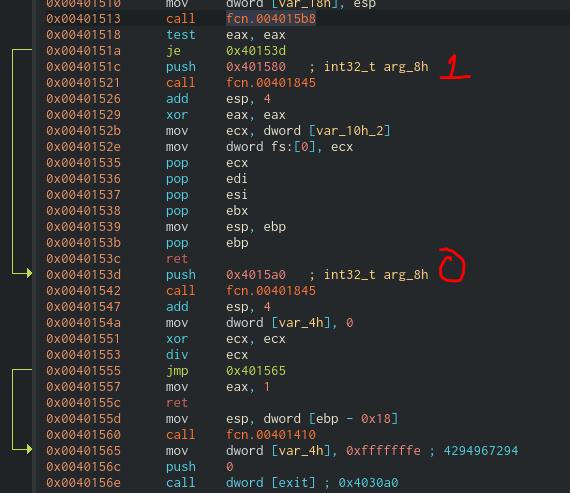
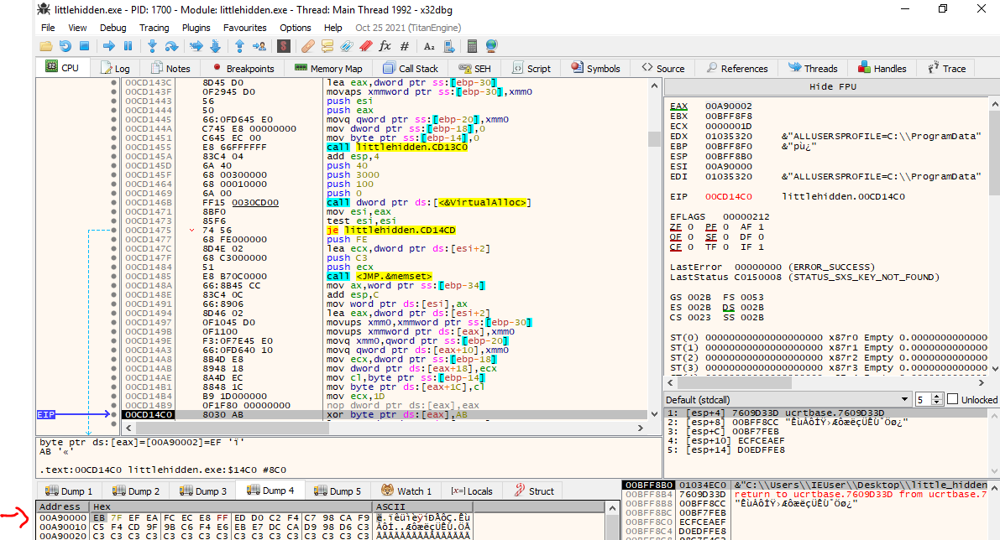

# Description
Little Hidden
# Solves
250 pts - 15 solves
# Writeup
We are given a ``PE32 executable (console)`` file.

Firstly, the excutable was ran and the below message box appeared.

The main function of the executable calls the function ``0x4015b8`` and examines whether the return value ise equtal to zero or one. In each case, the the process terminates. 

When the process is not debugged as shown above, the binary executes the code block at ``0x40153d`` and the ``Did you catch that`` message box appears. However, when the binary is debugged, the binary executes the code block at ``0x40151c`` and the ``You probably shouldn't run code that you're not sure what it does :)`` appears.

So I decided to look further on the code block at ``0x40153d``. An exception is raised on the offset ``0x401553`` because an integer is divided by zero. Therefore, we replace the ``div ecx`` instruction with ``NOPs``. Next, we patch the instructions ``jmp 0x401565`` and ``ret`` with ``NOPs``. After that, the function ``0x401410`` is called.

The function ``0x401410`` allocates 256 bytes to the memory that are initialized to zero and the offset is ``0xa90000``. The last 254 bytes of the initialized memory region are set to the value of ``0xc3``. Then the memory region between ``0xa90002`` and ``0xa9001e`` is initialized with some random bytes. These bytes that are shown below are xored with the value ``0xab`` and the output is the flag.

