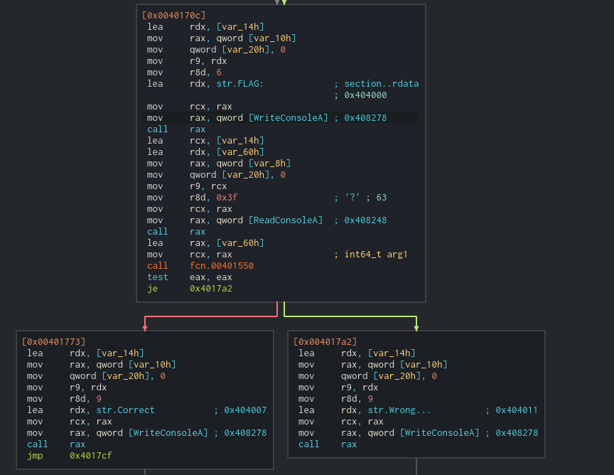
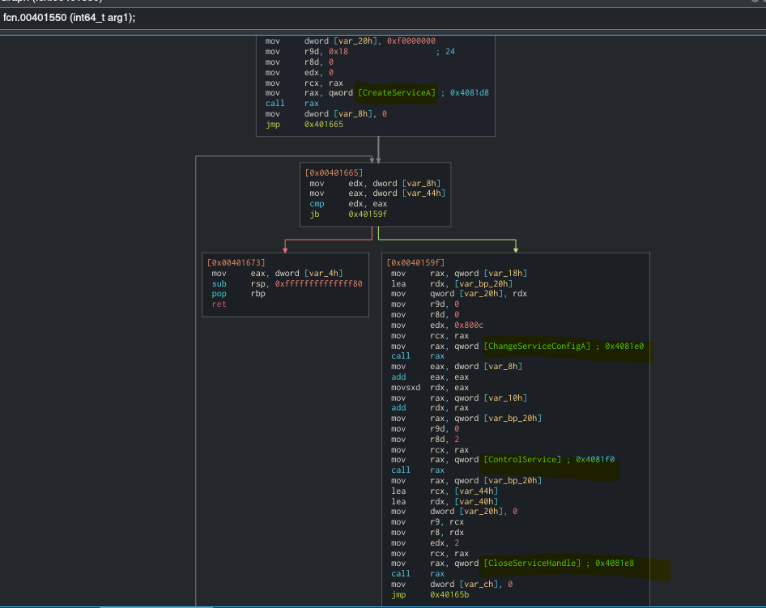
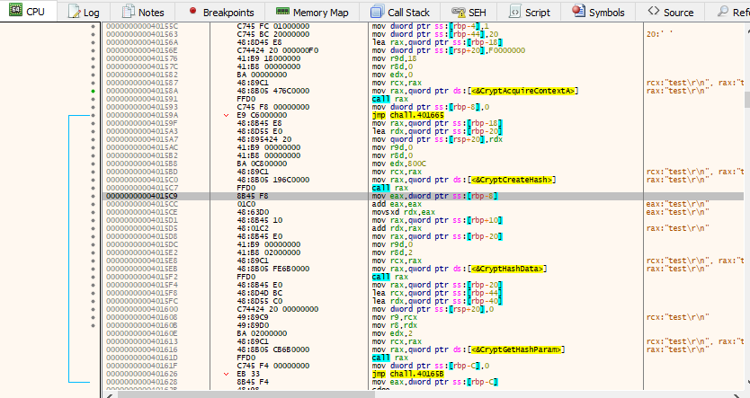

We are given a ``PE32+ executable (console) x86-64`` file.

The first thing that I did, was to run the executable. It asks for a flag(input) in the console and then the process terminates.

Next, I loaded the executable with ``Cutter`` and identified the offset that the input is read based on the ``ReadConsoleA`` symbol.

The input is stored at ``rbp-0x60`` and the offset of the input is passed as an argument to the function ``fcn.00401550``.

The function ``fcn.00401550`` imports 4 different symols from the ``ADVAPI32.dll``: ``ChangeServiceConfigA,CloseServiceHandle,ControlService,CreateServiceA``. However, I could not figure out what the function was doing with static analysis and figured out that was time for dynamic analysis :)

I have loaded the executable with ``x64dbg`` and set a breakpoint to ``fcn.00401550``. To my surprise, the function was calling other symbols instead of the imported ones.

My intial thought that binary was modifying the Import Table during the runtime to give you a hard time during the static analysis. So I decided to look at the Import Table that is stored in the ``.idata`` section. The offset of the ``ChangeServiceConfigA`` was pointing to the offset``CryptCreateHash``. Bingo! The rest of the imported symbols (from the ``ADVAPI32.dll``)  were pointing to other symbols.

Now it made sense. The binary splits our input to a set of 2 bytes and then calculates its SHA256 hash. Afterwards, the estimated SHA256 hashes are compared to harcoded hashes that are stored in the ``.data`` section. Our goal was to find the desired set of bytes that match the hardcoded SHA256 hashes. I wrote the python script ``solver.py`` to brute force the possible bytes that match the desired hashes and found the flag.

