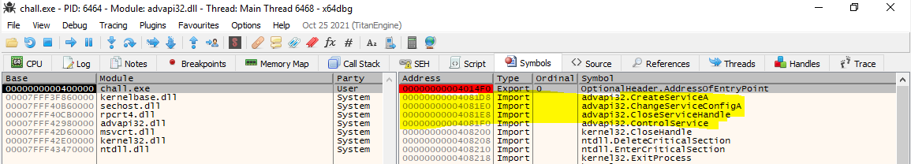
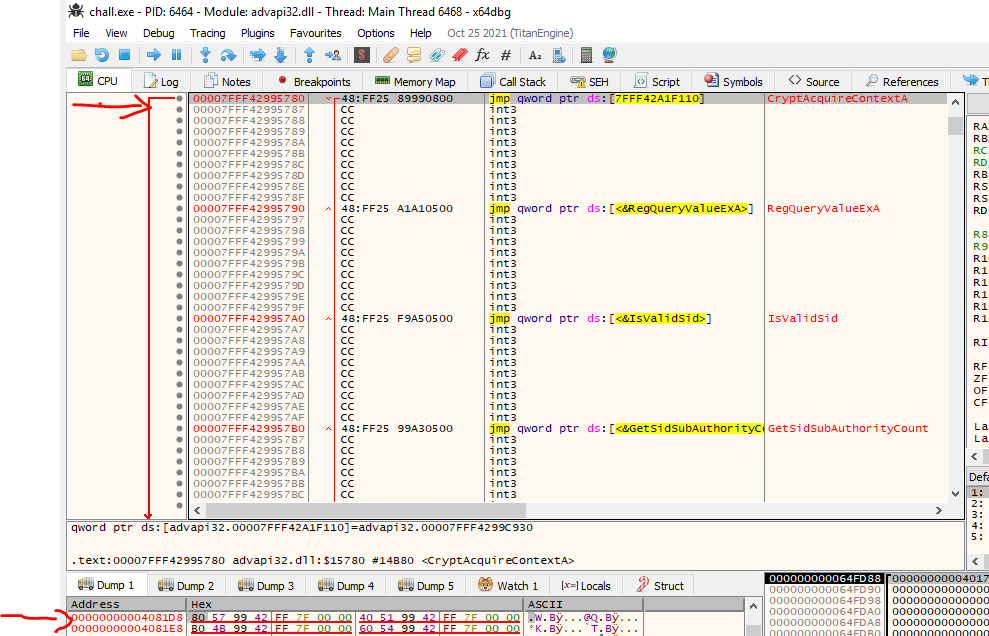

# Description
service charge
# Solves
104 pts - 90 solves
# Writeup
We are given a ``PE32+ executable (console) x86-64`` file.

The first thing that I did, was to run the executable. It asks for a flag(input) in the console and then the process terminates.


Next, I loaded the executable with ``Cutter`` and identified the offset that the input is read based on the ``ReadConsoleA`` symbol.


The input is stored at ``rbp-0x60`` and the offset of the input is passed as an argument to the function ``fcn.00401550``.

The function ``fcn.00401550`` imports 4 different symols from the ``ADVAPI32.dll``: ``ChangeServiceConfigA,CloseServiceHandle,ControlService,CreateServiceA``. However, I could not figure out what the function was doing with static analysis and figured out that was time for dynamic analysis :)


I have loaded the executable with ``x64dbg`` and set a breakpoint to ``fcn.00401550``. To my surprise, the function was calling other symbols instead of the imported ones.


My intial thought that binary was modifying the Import Table during the runtime to give you a hard time during the static analysis. So I decided to look at the Import Table that is stored in the ``.idata`` section. 



After following the imported address of the ``CreateServiceA``, it was pointing to the address of``CryptAcquireContextA``. Bingo! The rest of the imported symbols (from the ``ADVAPI32.dll``) were pointing to other symbols too.



Now it made sense. The binary splits our input to a set of 2 bytes. For each set of bytes, a SHA256 hash object is created with ``CryptCreateHash``. It should be mentioned that the algorithm is specified with ``ALG_ID`` field (0x800c->SHA256). Then, the SHA256 hash is estimated with the ``CryptGetHashParam``. Afterwards, the estimated SHA256 hashes are compared to the harcoded hashes that are stored in the ``.data`` (0x0403020-0x403410) section.

Our goal was to find the desired set of bytes where their SHA256 hashes match the hardcoded SHA256 hashes. I wrote the python script ``sol.py`` to brute force the possible bytes that match the desired hashes and found the flag.

# Solution
```
from wincrypto import CryptCreateHash,CryptHashData
from wincrypto.constants import CALG_SHA_256
import binascii
import struct


def brute_force(bb,hash):
	hasher = CryptCreateHash(CALG_SHA_256)
	CryptHashData(hasher,bb)
	if hasher.get_hash_val() == hash :
		return True
	else:
		return False

f = open(".data","r")
data = f.read()
hashes = []
flag = b''

while data:
	hashes.append(data[:64])
	data = data[64:]
del hashes[-1]

for i,hash in enumerate(hashes):
	target_hash = binascii.unhexlify(hash)
	for v in range(0xffff):
		bb = struct.pack("h",v)
		if brute_force(bb,target_hash):
			flag += bb
			break
print (flag)
```b'zer0pts{m0d1fy1ng_PE_1mp0rts_1s_4n_34sy_0bfusc4t10n}\r\n\x00\x00\x00\x00\x00\x00\x00\x00\x00\x00'```
```

# References
https://docs.microsoft.com/en-us/windows/win32/api/wincrypt/
